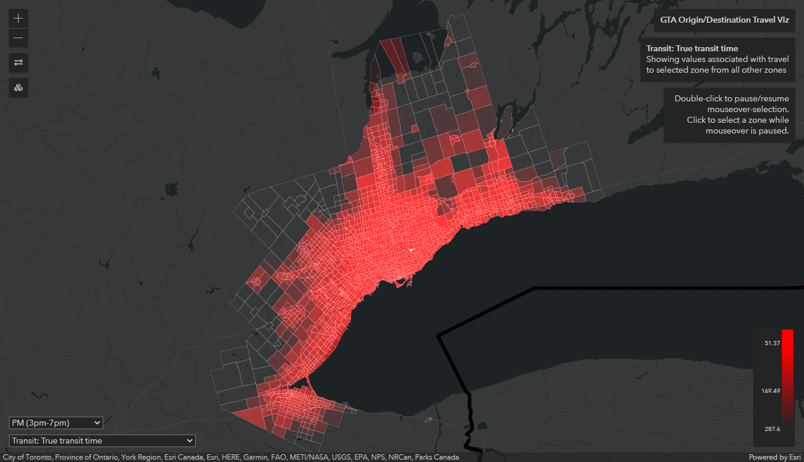
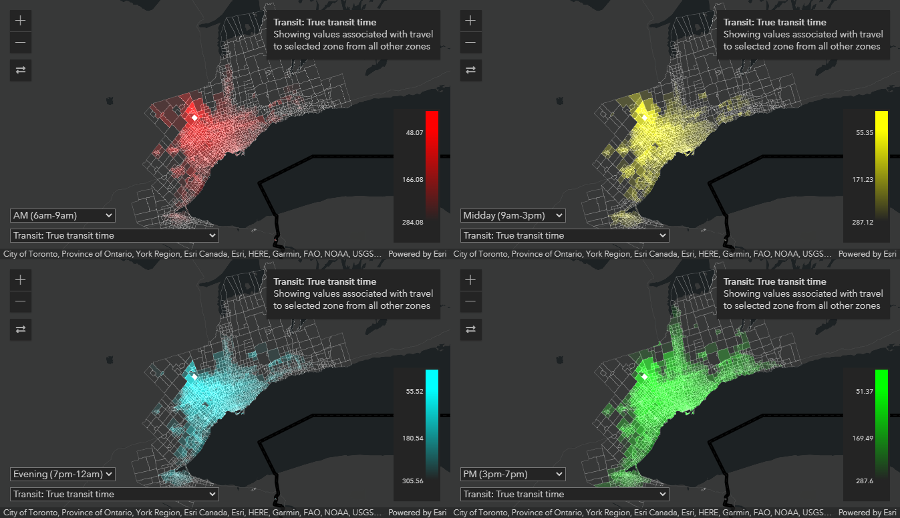
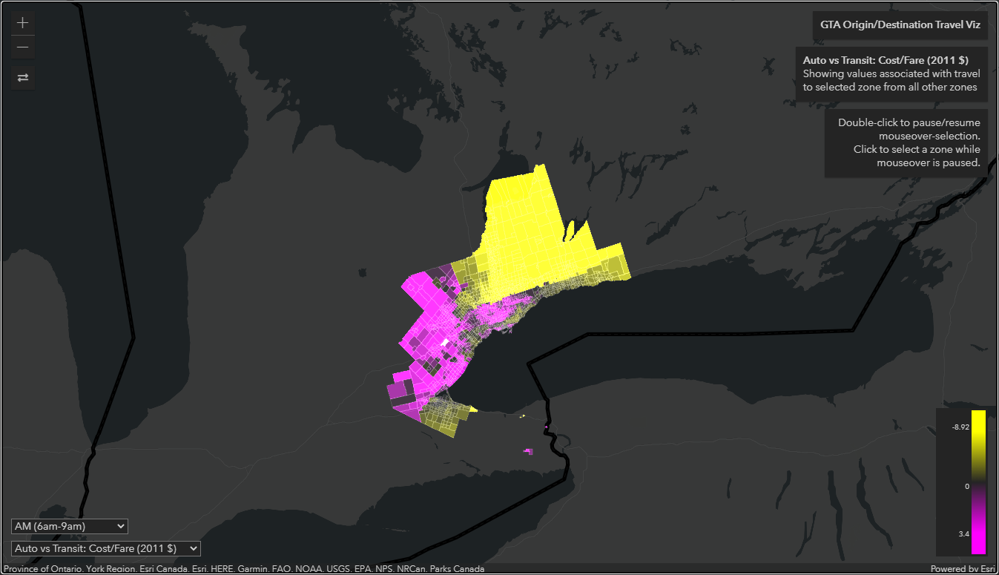

# Origin-Destination Visualization Layer for the ArcGIS API for JavaScript (4.18+)

This is an experimental sample that provides a custom layer class for the ArcGIS API for JavaScript that enables visualization of Origin/Destination data matrices using custom WebGL rendering.  An earlier version of this sample was based source code from the [Postcard from Esri](https://github.com/damix911/ds-demo-2019) sample [presented](https://www.esri.com/en-us/about/events/devsummit/agenda/agenda) at the [Esri Developer Summit 2019](https://www.esri.com/en-us/about/events/devsummit/overview). With great assistance from [Dario D'Amico](https://github.com/damix911), the current version of this project has been adapted to load OD matrix data into custom WebGL shaders as 2d texture data objects.  The WebGL shaders use these data to efficiently draw the origin/destination visualizations as a map layer with the ArcGIS API for JavaScript.

The purpose of the Origin-Destination layer in this project is to enable interactive visualization of origin-destination data matrices associated with polygon geometry data.  It uses code derived from samples provided by Esri (by Dario D'Amico) to draw polygons in a [custom WebGL layer view](https://developers.arcgis.com/javascript/latest/sample-code/custom-gl-visuals/index.html) to display zones.  When an origin/destination matrix is loaded, a 2d texture is generated using the raw values of the matrix as RGBA pixel values. The texture is passed to a custom WebGL shader as a data object, along with parameters that describe how to translate between origin/destination identifiers and texel coordinates/values, and how to convert a value to a colour.  The WebGL shader draws the polygon for each zone with the resulting colour based on a given metric describing its relationship with selected zone (representing either a common origin, or common destination). As a user interacts with the map, the current 'active' zone is updated, and this affects which origin/destination values are rendered on the map.  With this approach, the custom layer is able to interactively display the amount of time, cost, or other measures that relate to travelling to or from a selected zone and all other zones. The selected zone can be specified by hovering the mouse cursor or clicking the mouse on the map layer. With the displayed colours on the map updated very rapidly by the WebGL shader, it is an intuitive and interactive experience to visualize and compare different patterns in origin-destination relationships across a dataset with many zones.

### Demo

To view a single layer, open the following URL (*Caution: this sample downloads ~22mb of data on startup, and for each additional variable you choose to view once loaded.*) [https://highered-esricanada.github.io/od_layer/demo/index.html](https://highered-esricanada.github.io/od_layer/demo/index.html).

The demo app provides the following functionality:

* You can select the variable to view and the time period from the controls in the bottom left.  
* Mouseover or click on the map to select the origin/destination zone (double-click on the map to disable/enable the mouseover effect).
* To reverse the travel direction (to/from the selected zone), click the button near the top left.
* If you don't like the display colour, click on the legend display switch between primary/secondary colours.
* It *does* work on smartphone browsers, but is likely to run into memory limits on most devices (be sure to use it on wifi, or you'll quickly drain your data plan!)

A second demo presents a 2x2 dashboard-like view allowing you to simultaneously compare four different views (e.g., travel times for four different time periods).  This will load 4x the data as the first demo (~88mb).  It is best viewed on desktop browsers (give it time to load the data and initialize map views and WebGL shaders for all four maps): [https://highered-esricanada.github.io/od_layer/demo/dashboard.html](https://highered-esricanada.github.io/od_layer/demo/dashboard.html)

A third demo shows an option added to render values differently, with two gradients for values above/below a specified midpoint.  In this example, the difference between either cost or time associated with driving an automobile vs. taking public transit is calculated between two O/D matrices, and this difference is visualized using a different colour for values above zero (higher cost/time associated with transit) and below zero (higher cost or time associated with driving in an automobile).  Note that this demo will download about ~44mb on startup to load two O/D matrices of data: [https://highered-esricanada.github.io/od_layer/demo/difference.html](https://highered-esricanada.github.io/od_layer/demo/difference.html)

### Data requirements

Zone features must be provided as an input FeatureSet containing polygon geometries and at least one attribute that can be used as a Zone identifier. Each polygon must be assigned an attribute that can be used as a zone identifier - this identifier must be unique.

Origin-destination data must be provided as a protocol buffer data object, which will containe three properties: `origin_ids`, `destination_ids`, and `data`.  The `origin_ids` and `destination_ids` properties must contain an array of identifiers that relate to each of the zone features (in the FeatureSet noted above), and the values in these properties must correspond with the attribute you specify as the `zone_id_column` for your zone features.  The `data` property is a simple array of all values for the origin-destination matrix.  All values for a given origin (or 'row' in the original matrix) are stored in sequential order, followed by the next origin, etc.  The order of destination values for each origin must correspond sequentially with the Zone identifiers in the `destination_ids` property, and the order of each origin's set of values the data must similarly correspond sequentially with the Zone identifiers in the `origin_ids` property.

#### Prepare O/D data matrices

If you have origin-destination data in CSV format, with the first column and first row containing respectively the origin and destination zone identifiers, you can use the `utils/csv2pb.js` Node script to convert them in to protocol buffer data files.

### `ODLayer` class usage

The constructor for the `ODLayer` class requires an object with the following properties:

| Property | Description |
| --- | --- |
| `zone_boundaries` |  FeatureSet object containing polygons with zone identifier attributes  assigned to them. |
| `zone_id_column` | The name of the attribute to be used as zone identifiers. |
| `render_from_color` | A Colour object compatible with the [`esri/Color`](https://developers.arcgis.com/javascript/latest/api-reference/esri-Color.html) class (e.g., for red: `{r: 255, g:0, b: 0, a: 1}`) |
| `render_to_color` | A Colour object compatible with the [`esri/Color`](https://developers.arcgis.com/javascript/latest/api-reference/esri-Color.html) class (e.g., for red: `{r: 255, g:0, b: 0, a: 1}`) |
| `render_mid_color` | (optional) A Colour object compatible with the [`esri/Color`](https://developers.arcgis.com/javascript/latest/api-reference/esri-Color.html) class (e.g., for red: `{r: 255, g:0, b: 0, a: 1}`) |
| `zone_data` | (optional) An ODMatrix data object (must conform to the properties specified in the ODMatrix protocol buffer format) |
| `zone_data_url` | (optional) A URL to a protocol buffer data file containing an ODMatrix dataset |
| `active_zone_id` | The identifier of the selected zone to render. |
| `render_direction_outward` | If true, the layer is rendered to display travel from the selected zone to all others.  If false, the layer is rendered to display travel to the selected zone from all others. |
| `render_from_value` | If specified, sets the starting value used for ramping colours (corresponds with the `render_from_color` property).  If unspecified, one standard deviation below the mean for the whole matrix will be automatically chosen as the 'from' value. |
| `render_to_value` | If specified, sets the starting value used for ramping colours (corresponds with the `render_to_color` property) If unspecified, one standard deviation above the mean for the whole matrix will be automatically chosen as the 'from' value.|
| `render_mid_value` | If specified, sets the midpoint value used for ramping colours (corresponds with the `render_mid_color` property) |
| `render_border` | If false, the WebGL shader will not draw polygon boundaries. Its probably best to leave this false, and use a regular feature layer with the ArcGIS API for JavaScript to draw polygon boundaries. |
| `border_color` | A Colour object compatible with the [`esri/Color`](https://developers.arcgis.com/javascript/latest/api-reference/esri-Color.html) class (e.g., for red: `{r: 255, g:0, b: 0, a: 1}`) |
| `border_width` | The line width to use for rendering borders (not recommended to set large numbers for this) |
| `hover_enabled` | If true, the layer will update it's active_zone_id and render correspondingly as the mouse cursor moves over the layer. |
| `click_enabled` | If true, the layer will update it's active_zone_id and render correspondingly as the mouse cursor is clicked on the layer. |

The `ODLayer` class also has the following additional watchable properties:

| Property | Description |
| --- | --- |
| `zone_render_values` | Set as an object that provides the values calculated for the current O/D matrix dataset and used for ramping colours between the from/to/mid color properties.  Includes the following properties: `min`, `max`, `scale_from`, `scale_to`, `scale_mid`, and `use_mid` - the last two properties indicate whether a mid-point is being used for colour ramping, and what the mid-point value is. |

### development

This is a pure JavaScript library.  The ODLayer class can be added to any custom ArcGIS JavaScript API object by importing the `src/ODLayer.js` script (e.g., refer to the demo HTML samples).

Web applications using this must also have the Protocol buffer library loaded: https://cdn.jsdelivr.net/gh/dcodeIO/protobuf.js@6.11.2/dist/protobuf.min.js

### Acknowledgements

This work is a result of ongoing collaboration related the iCity project, with Eric Miller and researchers at the [University of Toronto Transportation Research Institute](https://uttri.utoronto.ca/).

Thanks to [Dario D'Amico](https://github.com/damix911) for providing valuable assistance, and excellent samples for developing custom WebGL layers.
